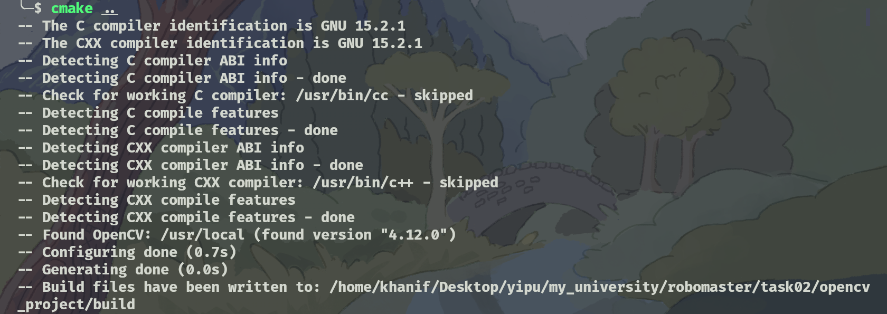
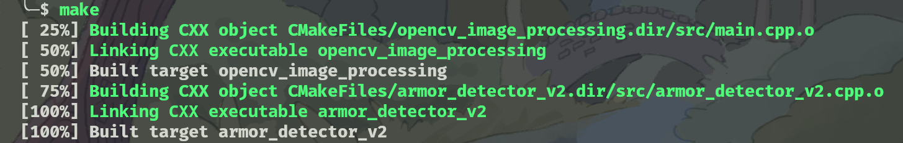

# OpenCV 图像处理基础实例

本项目是一个基于OpenCV的C++图像处理程序，实现了多种基础的图像处理操作。

## 项目结构

```
.
├── .gitignore          # Git忽略文件配置
├── CMakeLists.txt      # CMake构建配置文件
├── README.md           # 项目说明文档
├── build/              # 构建输出目录
│   ├── opencv_image_processing        # 基础图像处理可执行文件
│   ├── armor_detector_v2             # 装甲板检测可执行文件
│   └── CMakeFiles/                   # CMake生成的构建文件目录
├── src/                # 源代码目录
│   ├── main.cpp                   # 基础图像处理程序源代码
│   └── armor_detector_v2.cpp      # 改进版装甲板检测程序源代码
├── resources/          # 资源文件目录
│   ├── cosmos-7585071_1280.jpg           # 测试图像
│   ├── test_image_2.png                  # Robomaster比赛测试图像
│   └── 第二次培训：OpenCV C++ 图像处理基础 (1).pdf  # OpenCV基础教程
└── output/             # 处理后的图像输出目录
    ├── 01_original_image.jpg              # 原始图像
    ├── 02_grayscale_image.jpg              # 灰度图
    ├── 03_hsv_image.jpg                   # HSV图像
    ├── 04_blur_image.jpg                  # 均值滤波图像
    ├── 05_gaussian_blur_image.jpg         # 高斯滤波图像
    ├── 06_red_mask.jpg                   # 红色区域掩码
    ├── 07_red_contours.jpg               # 红色外轮廓（绿色绘制）
    ├── 08_red_bounding_boxes.jpg         # 红色边界框（蓝色绘制）
    ├── 09_binary_image.jpg               # 二值化图像
    ├── 10_dilated_image.jpg              # 膨胀处理图像
    ├── 11_eroded_image.jpg               # 腐蚀处理图像
    ├── 12_flood_fill.jpg                 # 漫水填充处理图像
    ├── 13_drawing_shapes_text.jpg        # 绘制图形和文字
    ├── 14_drawn_red_contours.jpg         # 绘制红色外轮廓
    ├── 15_drawn_red_bounding_boxes.jpg   # 绘制红色边界框
    ├── 16_rotated_35_degrees.jpg         # 旋转35度图像
    ├── 17_cropped_quarter.jpg            # 裁剪左上角1/4图像
    ├── armor_detection_v2_result.jpg      # 改进版装甲板检测结果图像
    ├── process.txt                       # 处理过程输出文本
    ├── terminal_cmake.png                # CMake构建过程截图
    └── terminal_make.png                 # Make编译过程截图
    
```

## 功能介绍

本程序实现了以下图像处理功能：

### 1. 图像颜色空间转换
- **灰度图转换**：将彩色图像转换为灰度图像
- **HSV转换**：将BGR图像转换为HSV颜色空间

### 2. 滤波操作
- **均值滤波**：使用5x5的核进行均值滤波，减少图像噪声
- **高斯滤波**：使用5x5的高斯核进行滤波，更好地保留边缘信息

### 3. 特征提取
- **红色区域提取**：使用HSV颜色空间提取图像中的红色区域
- **轮廓检测**：找到红色区域的外轮廓
- **边界框检测**：计算红色区域的最小外接矩形
- **轮廓面积计算**：计算每个红色轮廓的面积

### 4. 高亮区域处理
- **灰度化**：将彩色图像转换为灰度图像
- **二值化**：使用自适应阈值进行图像二值化
- **形态学操作**：
  - 膨胀：扩大白色区域
  - 腐蚀：缩小白色区域
- **漫水填充**：从图像中心点进行漫水填充处理

### 5. 图像绘制
- **基本图形绘制**：绘制圆形、矩形和文字
- **轮廓绘制**：绘制检测到的红色外轮廓
- **边界框绘制**：绘制红色区域的边界框

### 6. 图像变换
- **图像旋转**：将图像旋转35度
- **图像裁剪**：裁剪原图的左上角1/4区域

## 编译和运行

### 前提条件
- CMake (3.10或更高版本)
- C++编译器 (支持C++11或更高版本)
- OpenCV (4.x版本)

### 编译步骤

1. 创建构建目录
   ```bash
   mkdir build
   cd build
   ```

2. 运行CMake配置
   ```bash
   cmake ..
   ```

3. 编译项目
   ```bash
   make
   ```





### 运行程序

#### 基础图像处理程序

```bash
./opencv_image_processing
```

程序运行后，会执行以下操作：
1. 依次显示各种图像处理结果窗口
2. 按任意键可以切换到下一个处理结果
3. 自动将所有处理后的图像保存到 `../output` 目录
4. 在控制台输出检测到的红色轮廓的面积信息

```
红色轮廓 0 的面积: 0.5
红色轮廓 1 的面积: 0.5
红色轮廓 2 的面积: 1.5
红色轮廓 3 的面积: 179.5
红色轮廓 4 的面积: 0.5
红色轮廓 5 的面积: 74.5
红色轮廓 6 的面积: 37.5
红色轮廓 7 的面积: 0
红色轮廓 8 的面积: 0
红色轮廓 9 的面积: 0.5
红色轮廓 10 的面积: 16.5
红色轮廓 11 的面积: 0
红色轮廓 12 的面积: 0
红色轮廓 13 的面积: 0
红色轮廓 14 的面积: 1.5
红色轮廓 15 的面积: 0
红色轮廓 16 的面积: 7
红色轮廓 17 的面积: 0
红色轮廓 18 的面积: 686.5
红色轮廓 19 的面积: 6
红色轮廓 20 的面积: 2
红色轮廓 21 的面积: 0
红色轮廓 22 的面积: 0
红色轮廓 23 的面积: 0
红色轮廓 24 的面积: 1
......
红色轮廓 124 的面积: 37.5
红色轮廓 125 的面积: 0
红色轮廓 126 的面积: 4
红色轮廓 127 的面积: 0
所有处理后的图像已保存到 ../output 目录
```
中间的部分略，详细见`../output/process.txt`。

#### 装甲板检测程序

##### 装甲板检测程序

```bash
./armor_detector_v2
```

程序运行后，会执行以下操作：
1. 读取 `../resources/test_image_2.png` 图像
2. 基于参考代码重新实现的装甲板检测算法
3. 使用亮度阈值化和椭圆拟合提取灯条
4. 基于多重约束条件匹配灯条对
5. 在图像上绘制精确的装甲板四边形轮廓
6. 显示检测结果窗口
7. 将结果保存到 `../output/armor_detection_v2_result.jpg`
8. 在控制台输出提取到的灯条数量和匹配到的装甲板数量

### 输出图像

#### 基础图像处理程序输出

程序运行后，会在 `output` 目录中生成以下处理后的图像文件：

1. **01_original_image.jpg** - 原始图像
2. **02_grayscale_image.jpg** - 灰度图转换结果
3. **03_hsv_image.jpg** - HSV颜色空间转换结果
4. **04_blur_image.jpg** - 均值滤波处理结果
5. **05_gaussian_blur_image.jpg** - 高斯滤波处理结果
6. **06_red_mask.jpg** - 红色区域提取掩码
7. **07_red_contours.jpg** - 红色外轮廓检测（绿色绘制）
8. **08_red_bounding_boxes.jpg** - 红色区域边界框（蓝色绘制）
9. **09_binary_image.jpg** - 二值化处理结果
10. **10_dilated_image.jpg** - 膨胀处理结果
11. **11_eroded_image.jpg** - 腐蚀处理结果
12. **12_flood_fill.jpg** - 漫水填充处理结果
13. **13_drawing_shapes_text.jpg** - 绘制基本图形和文字
14. **14_drawn_red_contours.jpg** - 绘制红色外轮廓
15. **15_drawn_red_bounding_boxes.jpg** - 绘制红色边界框
16. **16_rotated_35_degrees.jpg** - 旋转35度图像
17. **17_cropped_quarter.jpg** - 裁剪左上角1/4图像

这些图像文件展示了各种图像处理算法的效果，可以用于对比不同处理方法的差异。

#### 装甲板检测程序输出

18. **armor_detection_v2_result.jpg** - 装甲板检测结果图像，包含：
   - 绿色四边形轮廓：精确标识装甲板的四个顶点
   - 绿色边界框：装甲板的最小外接矩形
   - 红色点：标识装甲板的中心位置
   - 文本标签：标识装甲板类型（Big Armor/Small Armor）

## 装甲板检测算法

### 算法原理

#### 装甲板检测算法

1. **预处理**：
   - 将图像转换为灰度图
   - 使用亮度阈值化提取高亮区域
   - 形态学膨胀操作连接断裂区域

2. **灯条提取**：
   - 查找所有轮廓
   - 使用椭圆拟合轮廓
   - 调整矩形方向（ANGLE_TO_UP）
   - 基于面积、长宽比、凸度等特征筛选灯条
   - 扩展灯条区域进行颜色判断

3. **灯条匹配**：
   - 按x坐标排序灯条
   - 两两匹配灯条对
   - 基于平行度、高度差、位置关系等约束条件筛选
   - 判断装甲板类型（大装甲板/小装甲板）

4. **装甲板构建**：
   - 扩展灯条高度
   - 计算装甲板四个顶点
   - 生成装甲板描述符

### 关键参数

#### 算法参数

- **亮度阈值**：210
- **颜色阈值**：40
- **灯条最小面积**：10
- **灯条最大角度**：45度
- **灯条最大长宽比**：1.0
- **灯条最小凸度**：0.5
- **灯条最大角度差**：7度
- **灯条最大高度差比**：0.2
- **灯条最大Y差比**：2.0
- **灯条最小X差比**：0.5
- **大装甲板比例**：3.2
- **小装甲板比例**：2.0
- **装甲板最小长宽比**：1.0
- **装甲板最大长宽比**：5.0

### 算法特点

#### 算法特点

1. **精确度高**：基于椭圆拟合和多重约束条件，提高检测精度
2. **鲁棒性强**：使用亮度阈值化和颜色判断，减少环境光影响
3. **结构化设计**：采用面向对象设计，代码结构清晰
4. **可扩展性好**：易于添加新的特征和约束条件


## 代码说明

### 主要函数和操作

1. **图像读取和显示**
   ```cpp
   Mat img = imread("../resources/cosmos-7585071_1280.jpg");
   imshow("窗口名称", img);
   ```

2. **颜色空间转换**
   ```cpp
   cvtColor(img, grayImg, COLOR_BGR2GRAY);  // 转换为灰度图
   cvtColor(img, hsvImg, COLOR_BGR2HSV);    // 转换为HSV
   ```

3. **滤波操作**
   ```cpp
   blur(img, blurImg, Size(5, 5));                          // 均值滤波
   GaussianBlur(img, gaussianImg, Size(5, 5), 1.5);        // 高斯滤波
   ```

4. **颜色区域提取**
   ```cpp
   inRange(hsvImg, Scalar(0, 100, 100), Scalar(10, 255, 255), redMask);
   ```

5. **轮廓检测**
   ```cpp
   findContours(mask, contours, hierarchy, RETR_EXTERNAL, CHAIN_APPROX_SIMPLE);
   ```

6. **形态学操作**
   ```cpp
   Mat kernel = getStructuringElement(MORPH_RECT, Size(5, 5));
   dilate(binaryImg, dilateImg, kernel);    // 膨胀
   erode(binaryImg, erodeImg, kernel);      // 腐蚀
   ```

7. **图像绘制**
   ```cpp
   circle(img, center, radius, color, thickness);      // 绘制圆形
   rectangle(img, pt1, pt2, color, thickness);         // 绘制矩形
   putText(img, text, org, fontFace, fontScale, color, thickness);  // 绘制文字
   ```

8. **图像变换**
   ```cpp
   // 旋转
   Mat rotationMatrix = getRotationMatrix2D(center, angle, scale);
   warpAffine(src, dst, rotationMatrix, size);
   
   // 裁剪
   Mat cropped = img(Rect(x, y, width, height));
   ```

## 学习资源

项目参考了 `resources/第二次培训：OpenCV C++ 图像处理基础 (1).pdf` 文档中的示例代码和方法。还参考了[SEU-SuperNova-CVRA](https://github.com/SEU-SuperNova-CVRA/Robomaster2018-SEU-OpenSource/tree/master/Armor)团队的代码。


